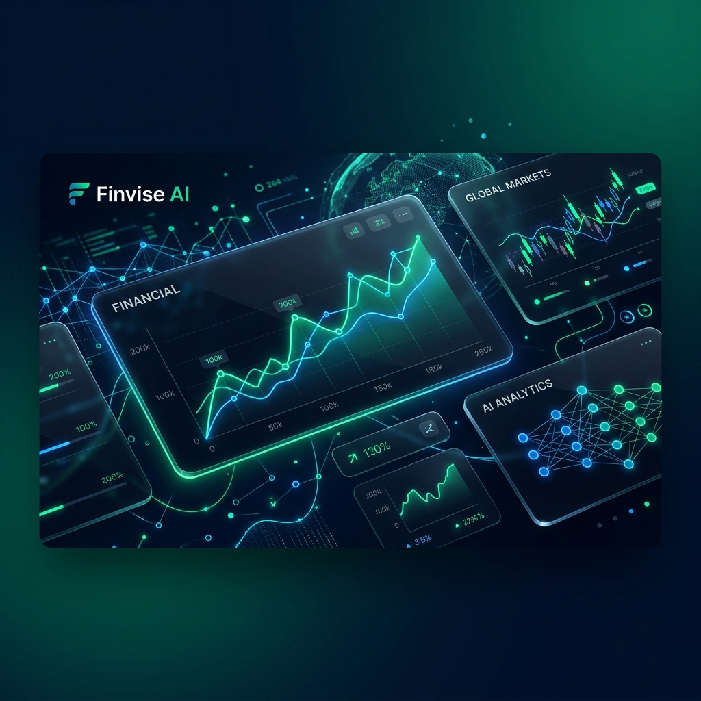
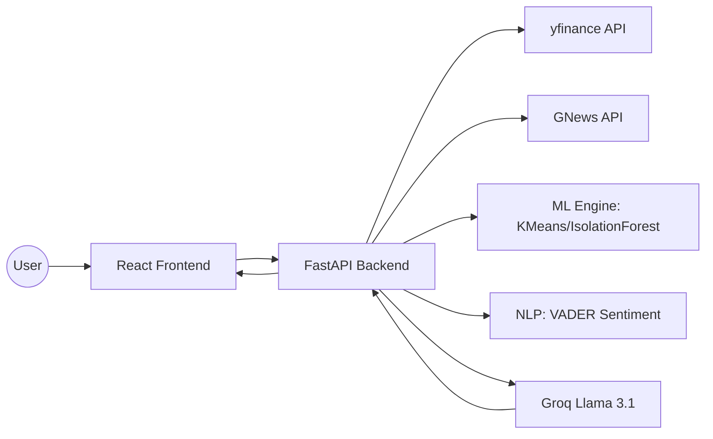

# 🚀 Finvise AI: AI-Powered Market Intelligence Dashboard



[](https://fastapi.tiangolo.com/)
[](https://reactjs.org/)
[](https://tailwindcss.com/)
[](https://groq.com/)
[](https://opensource.org/licenses/MIT)

**Finvise AI** is a next-generation stock market analysis platform that bridges the gap between traditional technical analysis and modern AI. Built with a terminal-inspired "Situation Room" UI, it provides traders with real-time insights, ML-driven indicators, and a conversational AI interface to navigate complex market movements.

---

## ✨ Key Features

### 🧠 1. AI-Powered Market Insights
- **Conversational Intelligence:** Chat directly with the market using Groq-powered Llama 3.1 models.
- **Context-Aware:** The AI doesn't just guess; it analyzes current price action, technical levels, and news sentiment before responding.

### 📊 2. ML-Driven Technical Analysis
- **K-Means Clustering:** Automatically calculates significant Support and Resistance levels based on historical price density.
- **Anomaly Detection:** Uses the **Isolation Forest** algorithm to identify unusual volume spikes that might precede major breakouts or breakdowns.
- **Trend Engine:** Real-time SMA (50/200) crossovers for bullish/bearish trend detection.

### 📰 3. News Intelligence & NLP Sentiment
- **Sentiment Engine:** Powered by **VADER NLP**, Finvise AI scrapes global news headlines and quantifies "market mood" into compound scores.
- **Live Feed:** A high-density feed of the latest technical and financial news curated for the Indian stock market (NSE).

### 📈 4. Pro-Grade Visualization
- **Interactive Candlestick Charts:** High-performance, lightweight charts with multiple timeframes (1M, 3M, 6M, 1Y).
- **Terminal UI:** An immersive, dark-mode dashboard designed for maximum data density and minimal distractions.

---

## 🛠️ Tech Stack

- **Frontend:** React 18, Tailwind CSS, Lucide Icons, Lightweight Charts.
- **Backend:** FastAPI (Python), Groq Llama-3 (Cloud Inference).
- **Data & ML:** 
  - `yfinance` - Historical & Real-time market data.
  - `scikit-learn` - K-Means & Isolation Forest models.
  - `vaderSentiment` - Lexicon-based sentiment analysis.
  - `GNews` - Real-time financial news extraction.

---

## 🚀 Getting Started

### Prerequisites
- **Python:** 3.10 or higher
- **Node.js:** 18.x or higher
- **Groq API Key:** [Get one here](https://console.groq.com/)

### 1. Backend Setup
```bash
# Navigate to root
python -m venv venv
source venv/bin/activate  # On Windows: venv\Scripts\activate
pip install -r requirements.txt
```

Create a `.env` file in the root directory:
```env
GROQ_API_KEY=your_key_here
```

Run the backend:
```bash
python main.py
```

### 2. Frontend Setup
```bash
cd frontend
npm install
npm run dev
```

The app will be available at `http://localhost:5173`.

---

## 🏗️ Architecture



---

## 📜 License
Distritubed under the MIT License. See `LICENSE` for more information.

## ⚠️ Disclaimer
This tool is for **educational and research purposes only**. Financial markets involve significant risk. Always consult with a certified financial advisor before making any investment decisions. The AI predictions are based on historical patterns and do not guarantee future results.

